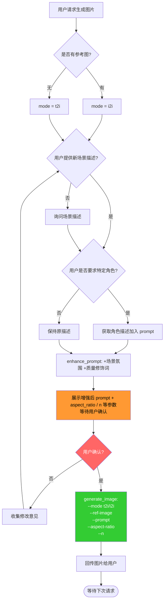

# Image Generation - 图片生成（MiniMax API）

## 核心流程



---

## 触发判断

| 用户表达 | 模式 | 说明 |
|---------|------|------|
| "生成图片：xxx" | **t2i** | 纯文本生成 |
| "帮我画一张..." | **t2i** | 纯文本生成 |
| 发送图片 + "以此图生成..." | **i2i** | 图生图模式 |
| 发送图片 + "保持这个角色..." | **i2i** | 角色参考 |

---

## 📝 Prompt 优化策略

### t2i 模式 - 推荐包含的元素

```
[主体描述] + [场景/背景] + [风格] + [光线/氛围] + [质量修饰词]
```

| 部分 | 示例 | 必要性 |
|------|------|--------|
| **主体** | "a cat on the beach" | ✅ 必须 |
| **场景** | "standing on a beach at sunset" | ✅ 必须 |
| **风格** | "anime style" or "photorealistic" | ✅ 推荐 |
| **光线** | "soft warm lighting, golden hour" | 推荐 |
| **质量** | "high quality, detailed, 8K" | 推荐 |

---

## 🎨 风格参考

| 风格 | Prompt 片段 |
|------|------------|
| 动漫/吉卜力 | `anime style, Studio Ghibli, soft watercolor-like` |
| 写实摄影 | `photorealistic, detailed texture, professional photography, 8K` |
| 像素艺术 | `pixel art style, 16-bit, retro game aesthetic` |
| 厚涂插画 | `digital art, painterly style, rich textures, concept art` |
| 赛博朋克 | `cyberpunk style, neon lights, futuristic city` |
| 中世纪奇幻 | `medieval fantasy style, castle, armor, epic` |
| 水彩 | `watercolor painting style, soft colors, delicate` |

---

## 🔧 生成参数推荐

### 基础参数（大多数场景够用）

```bash
--aspect-ratio 4:3            # 竖屏常用
--prompt-optimizer            # 开启 AI prompt 优化
--n 1                         # 默认 1 张
```

### 宽高比选择

| 比例 | 尺寸 | 适用场景 |
|------|------|---------|
| `1:1` | 1024x1024 | 头像、方图、社交媒体 |
| `4:3` | 1152x864 | 通用竖图 |
| `16:9` | 1280x720 | 横版海报、横图 |
| `9:16` | 720x1280 | 手机壁纸、Story |
| `3:2` | 1248x832 | 摄影构图、横图 |
| `21:9` | 1344x576 | 宽银幕、电影感 |

### 质量/数量控制

| 场景 | 推荐参数 | 原因 |
|------|---------|------|
| 快速测试 | `--n 1` | 节省额度 |
| 正式使用 | `--n 2-3` | 有选择余地 |
| 抽卡/不确定 | `--n 3` + `--seed` | 便于对比和复现 |

---

## 📁 参考图路径规则

OpenClaw 接收的图片保存在：
```
/home/h2mzzz/.openclaw/media/inbound/{uuid}.{ext}
/home/h2mzzz/.openclaw/media/inbound/{date}/{uuid}.{ext}
```

**自动查找逻辑：**
1. 检查消息是否附带图片
2. 获取 OpenClaw 分配的本地路径
3. 验证文件存在且大小合理（>1KB）
4. 传给 `--ref-image` 参数

---

## ⚠️ 失败处理与重试

| 错误码 | 原因 | 处理方式 |
|--------|------|---------|
| 1026 | 内容涉及敏感 | 修改 prompt，去除敏感词 |
| 1008 | 额度不足 | 告知用户额度情况 |
| 1002 | 限流 | 等待 5-10 秒后重试 |
| 2013 | 参数异常 | 检查 prompt 长度/格式 |

---

## 🚀 调用示例

### 文生图（t2i）

```bash
/usr/bin/python3 ~/.openclaw/skills/image/scripts/image_gen.py \
  --prompt "A cute white cat wearing a chef outfit, standing in a cozy kitchen, holding a meat skewer, warm fireplace in background, anime style" \
  --aspect-ratio 4:3 \
  --output ~/.openclaw/openclaw-data/image/generated/cat_chef.png
```

### 图生图（i2i）

```bash
/usr/bin/python3 ~/.openclaw/skills/image/scripts/image_gen.py \
  --mode i2i \
  --prompt "the same character in a medieval castle, wearing fantasy armor" \
  --ref-image /home/h2mzzz/.openclaw/media/inbound/xxx.jpg \
  --aspect-ratio 16:9 \
  --output ~/.openclaw/openclaw-data/image/generated/character_fantasy.png
```

---

## 📊 Skill 状态

| 项目 | 值 |
|------|---|
| 模型 | `image-01`（默认） |
| Token Plan 每日额度 | 50-200 张（视套餐） |
| API Host | `https://api.minimaxi.com` |
| 输出目录 | `~/.openclaw/openclaw-data/image/generated/` |
| 参考图目录 | `~/.openclaw/openclaw-data/image/references/` |
| Wrapper 脚本 | `/usr/bin/python3 ~/.openclaw/skills/image/scripts/image_gen.py` |

## 📁 存储规范

生成的图片**持久化保存**到 `~/.openclaw/openclaw-data/image/generated/`，不删除。
参考图可收藏到 `~/.openclaw/openclaw-data/image/references/`。
