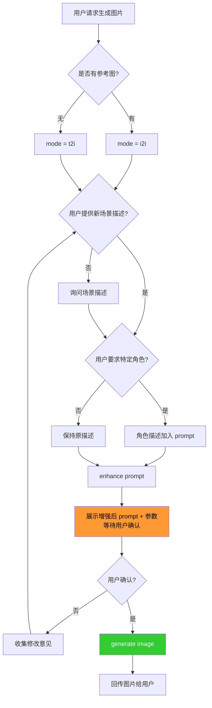

# Image Generation

## Overview

根据文字描述或参考图生成图片。支持文生图（t2i）和图生图（i2i）两种模式，自动优化 prompt 质量并管理生成文件。

## When to Use

- "生成图片：xxx"、"帮我画一张..."
- 发送参考图 + "以此图生成..."、"保持这个角色..."
- 用户描述画面内容要求生成

### When NOT to Use

- 用户要求编辑、裁剪、压缩已有图片
- 用户要求 OCR 识别图片文字
- 用户只是分享图片，无生成意图

## Core Flow



## Quick Reference

```bash
# 文生图
/usr/bin/python3 ~/.openclaw/skills/image/scripts/image_gen.py \
  --prompt "A cute cat on the beach, anime style" --aspect-ratio 4:3

# 图生图
/usr/bin/python3 ~/.openclaw/skills/image/scripts/image_gen.py \
  --mode i2i --prompt "same character in a castle" \
  --ref-image <参考图路径> --aspect-ratio 16:9
```

## Prompt Strategy

t2i 推荐：`[主体] + [场景] + [风格] + [光线] + [质量修饰词]`

| 风格 | Prompt 片段 |
|------|------------|
| 动漫/吉卜力 | `anime style, Studio Ghibli, soft watercolor-like` |
| 写实摄影 | `photorealistic, detailed texture, professional photography, 8K` |
| 像素艺术 | `pixel art style, 16-bit, retro game aesthetic` |
| 厚涂插画 | `digital art, painterly style, rich textures, concept art` |
| 赛博朋克 | `cyberpunk style, neon lights, futuristic city` |
| 水彩 | `watercolor painting style, soft colors, delicate` |

## Parameters

| 参数 | 默认值 | 说明 | 范围 |
|------|--------|------|------|
| `--prompt` | **必需** | 图片描述文本 | 任意文本 |
| `--mode` | `t2i` | 生成模式 | `t2i`, `i2i` |
| `--ref-image` | 自动查找 | i2i 参考图路径 | 文件路径 |
| `--aspect-ratio` | `4:3` | 宽高比 | `1:1`, `4:3`, `16:9`, `9:16`, `3:2`, `21:9` |
| `--n` | `1` | 生成数量 | 1-9 |
| `--seed` | 随机 | 随机种子 | 整数 |
| `--output` | 自动生成 | 输出路径 | 文件路径 |

默认启用 `--prompt-optimizer`，可用 `--no-prompt-optimizer` 关闭。

## Reference Image

i2i 模式下如未指定 `--ref-image`，脚本自动查找 `~/.openclaw/media/inbound/` 中最新图片。

## Common Mistakes

| 错误 | 原因 | 解决方式 |
|------|------|---------|
| 生成失败（1026） | prompt 含敏感内容 | 修改 prompt |
| 额度不足（1008） | Token Plan 用尽 | 等次日重置 |
| 限流（1002） | 请求频繁 | 等待 5-10 秒重试 |
| 参数异常（2013） | prompt 过长或格式错误 | 缩短 prompt |
| i2i 无参考图 | inbound 无图片 | 确认用户已发送图片 |

## Environment

API 配置、额度、目录结构、错误码详情见 `references/api_config.md`。
