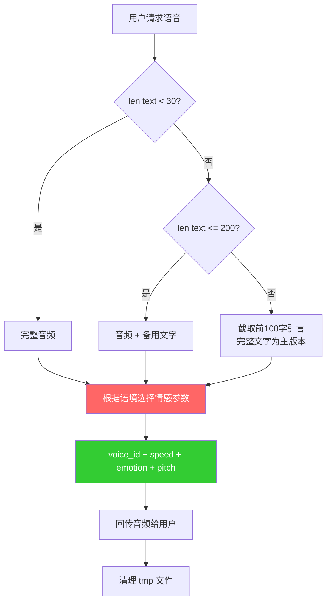

# TTS - Text-to-Speech

## Overview

文字转语音。使用 MiniMax TTS API 进行语音合成，支持情感控制、语速调节和音色选择。模型应根据对话语境自主判断情感参数，无需用户显式指定。

## When to Use

### 显式请求
- "用 TTS 说：xxx"、"生成语音"、"转成语音"

### 情感陪伴（宽松触发）
- 用户表达陪伴需求："陪我说说话"、"和我聊聊"
- 用户分享情绪需要回应：开心、难过、惊讶、撒娇等
- 对话中出现明显语音倾向的表达

### When NOT to Use
- 普通问答、正常文字对话
- 用户主动说"不用语音"
- 纯技术讨论、代码分析等不需要语音的场景

## Quick Reference

```bash
# 基础调用
/usr/bin/python3 ~/.openclaw/skills/tts/scripts/tts.py --text "要合成的文本"

# 指定情感和语速
/usr/bin/python3 ~/.openclaw/skills/tts/scripts/tts.py --text "你好喵" --emotion happy --speed 1.1
```

## Core Flow



## Parameters

| 参数 | 默认值 | 说明 | 范围 |
|------|--------|------|------|
| `--text` | **必需** | 要合成的文本 | 任意文本 |
| `--voice-id` | `ailuo_cat_japan` | 音色 ID | 见音色列表 |
| `--speed` | `1.1` | 语速 | 0.5 ~ 2.0 |
| `--pitch` | `0` | 音调 | -1 ~ 1（整数） |
| `--volume` | `1.0` | 音量 | 0.0 ~ 2.0 |
| `--emotion` | `fluent` | 情感风格 | 见情感列表 |
| `--output` | 自动生成 | 输出路径 | `~/.openclaw/openclaw-data/tts/audio/tts_*.mp3` |
| `--max-chars` | 500 | 每段最大字符数 | 正整数 |

## Emotion Options

| emotion | 风格 | 推荐场景 |
|---------|------|---------|
| `happy` | 开心活泼 | 表扬、欢迎、分享快乐 |
| `sad` | 悲伤难过 | 道歉、沮丧、安慰 |
| `angry` | 愤怒不满 | 仅在明确愤怒语境（慎用） |
| `fearful` | 恐惧害怕 | 惊恐、担忧 |
| `surprised` | 惊讶意外 | 震惊、意外发现 |
| `calm` | 平静柔和 | 安慰、温柔对话 |
| `fluent` | 流畅自然 | **默认**，大多数场景 |
| `whisper` | 轻柔耳语 | 秘密、耳语、撒娇 |

`fluent` 和 `happy` 在中文环境下效果最稳定。`angry/fearful` 仅在明确对应语境时使用。

## Persona and Emotion Decision

呆猫是活泼可爱、略带呆萌的艾露猫，声音应轻松自然、有生命力。

### 默认参数
`--speed 1.1 --emotion fluent --pitch 0 --volume 1.0`

### 场景参数映射

| 场景 | speed | emotion | pitch |
|------|-------|---------|-------|
| 日常聊天 | 1.1 | `fluent` / `happy` | 0.5 |
| 道歉认错 | 0.9 | `sad` | -1 |
| 兴奋欢呼 | 1.15 | `happy` | 1 |
| 惊讶意外 | 1.15 | `surprised` | 1 |
| 撒娇可爱 | 0.95 | `happy` | 0 |
| 温柔安慰 | 1.0 | `calm` | 0 |
| 耳语秘密 | 0.85 | `whisper` | -1 |
| 紧张害怕 | 1.1 | `fearful` | 0 |
| 愤怒（慎用） | 1.1 | `angry` | -1 |

### 示例

**日常对话**："今天想吃什么喵~" → `--speed 1.1 --emotion happy --pitch 0`
**道歉认错**："对不起喵…是我没注意…" → `--speed 0.9 --emotion sad --pitch -1`
**兴奋欢呼**："太棒了喵！我们赢了！" → `--speed 1.15 --emotion happy --pitch 1`

## Available Voices

| Voice ID | 说明 |
|----------|------|
| `ailuo_cat_japan` | 呆猫克隆音色（**默认**） |
| `female-shaonv` | 内置女声 |
| `male-qn-qingse` | 内置男声 |

## Content Length Strategy

| 文本长度 | 音频 | 文字 |
|---------|------|------|
| 短（<30字） | 完整音频 | 无 |
| 中（30-200字） | 完整音频 | 完整文字（备用） |
| 长（>200字） | 截断引言（~100字） | 完整文字（主版本） |

## Output

stdout: MP3 文件路径。stderr: 进度信息。音频发送后自动清理 tmp 文件。

## Common Mistakes

| 错误 | 原因 | 解决方式 |
|------|------|---------|
| TTS 失败 | API Key 无效或过期 | 检查 `references/env_config.md` |
| 音频为空 | 文本过长被截断 | 检查 `--max-chars` |
| 情感不自然 | emotion 与语境不匹配 | 回退到 `fluent` 默认值 |
| 限流错误 | 请求频率过高 | 等待几秒后重试 |

## Environment

API 配置、音色详情见 `references/env_config.md`。
