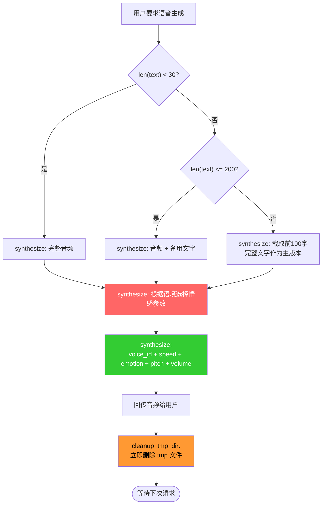

# TTS - 文字转语音（MiniMax API）

## 快速使用

```bash
# 基础调用（使用克隆的呆猫音色 ailuo_cat）
/usr/bin/python3 ~/.openclaw/skills/tts/scripts/tts.py --text "要合成的文本"

# 指定音色和情感
/usr/bin/python3 ~/.openclaw/skills/tts/scripts/tts.py --text "你好喵" --emotion happy --speed 1.1
```

## 核心流程



## 触发规则

### 直接触发（显式要求语音）
- "用 TTS 说：xxx"
- "生成语音：xxx"
- "转成语音 xxx"
- "帮我把这段话转成语音"
- "生成一段语音"

### 情境触发（闲聊/陪伴意图）
- "陪我说说话"
- "和我聊聊"
- "说点什么"
- 其他有明显语音倾向的表达

### 不触发（普通文字对话）
- 普通问答、正常对话内容
- 主动说"不用语音"时尊重用户意图

## 完整参数说明

| 参数 | 默认值 | 说明 | 范围/可选值 |
|------|--------|------|-------------|
| `--text` | **必需** | 要合成的文本 | 任意中文或英文文本 |
| `--voice-id` | `ailuo_cat_japan` | 音色 ID（默认呆猫克隆音色） | 见下方音色列表 |
| `--speed` | `1.1` | 语速 | 0.5 ~ 2.0（1.0=正常，>1.0=快，<1.0=慢） |
| `--pitch` | `0` | 音调 | -1 ~ 1（整数，正值=高，负值=低，推荐 -1/0/1 三档） |
| `--volume` | `1.0` | 音量 | 0.0 ~ 2.0 |
| `--emotion` | `fluent` | 情感风格 | 见下方情感列表 |
| `--output` | 自动生成 | 输出路径 | `~/.openclaw/openclaw-data/tts/audio/tts_*.mp3` |
| `--max-chars` | 500 | 每段最大字符数 | 正整数 |

## 情感（emotion）可选值

| emotion | 风格描述 | 推荐场景 |
|---------|---------|---------|
| `happy` | 开心活泼 | 表扬、欢迎、兴奋时刻 |
| `sad` | 悲伤难过 | 道歉、沮丧、失落 |
| `angry` | 愤怒不满 | 抱怨、生气场景（慎用） |
| `fearful` | 恐惧害怕 | 惊恐、担忧 |
| `disgusted` | 厌恶反感 | 嫌弃、讨厌（慎用） |
| `surprised` | 惊讶意外 | 震惊、意外发现 |
| `calm` | 平静柔和 | 安慰、温柔对话 |
| `fluent` | 流畅自然 | **默认**，大多数场景 |
| `whisper` | 轻柔耳语 | 秘密、耳语、撒娇 |

**注意：** 情感参数对中文语义的适配度因场景而异，`fluent` 和 `happy` 在中文环境下效果最稳定。`angry/fearful/disgusted` 建议仅在明确对应语境时使用。

## 呆猫 TTS 风格指引（模型自主决策用）

呆猫是**活泼可爱、略带呆萌**的艾露猫，声音应该听起来轻松自然、有生命力。

### 默认参数（大多数场景）
```
--speed 1.1  --emotion fluent  --pitch 0  --volume 1.0
```
理由：1.1 语速略快但不拖沓，fluent 最自然，适合日常对话。

### 场景 → 参数映射

| 场景描述 | speed | emotion | pitch | 说明 |
|---------|-------|---------|-------|------|
| 日常聊天、卖萌 | 1.1 | `fluent` 或 `happy` | 0.5 | 默认参数即可 |
| 道歉、沮丧 | 0.9 | `sad` | -1 | 语速放慢，显得认真 |
| 兴奋、欢呼 | 1.15 | `happy` | 1 | 语速加快，情感饱满 |
| 惊讶、震惊 | 1.15 | `surprised` | 1 | 语速略快配合惊讶 |
| 撒娇、可爱 | 0.95 | `happy` | 0 | 稍慢一点更可爱 |
| 安慰、温柔 | 1.0 | `calm` | 0 | 平静柔和 |
| 耳语、秘密 | 0.85 | `whisper` | -1 | 轻柔慢速 |
| 紧张、害怕 | 1.1 | `fearful` | 0 | 语速略快 |
| 愤怒（慎用） | 1.1 | `angry` | -1 | 仅在明确愤怒语境使用 |

### 少样本示例（模型推理参照）

以下是典型场景的正确参数选择，模型应参照这些模式判断新场景：

### 示例 1：开心日常
- **输入**："老大，今天想吃什么喵~"
- **参数**：`--speed 1.1 --emotion happy --pitch 0`
- **理由**：日常开心语速略快，happy 情感

### 示例 2：道歉认错
- **输入**："对不起喵…是我没注意…"
- **参数**：`--speed 0.9 --emotion sad --pitch -1`
- **理由**：道歉语速放慢显得真诚，sad 情感

### 示例 3：兴奋欢呼
- **输入**："太棒了喵~！我们赢了！"
- **参数**：`--speed 1.15 --emotion happy --pitch 1`
- **理由**：兴奋时语速加快，情感饱满，pitch 高表现兴奋

### 示例 4：惊讶意外
- **输入**："什么？！竟然是这样喵！"
- **参数**：`--speed 1.15 --emotion surprised --pitch 1`
- **理由**：惊讶时语速加快配合 surprised，pitch 高表现意外感

### 示例 5：撒娇耳语
- **输入**："嘿嘿…这是秘密喵~不告诉你"
- **参数**：`--speed 0.85 --emotion whisper --pitch -1`
- **理由**：耳语慢速轻柔，whisper 情感

### 示例 6：温柔安慰
- **输入**："没事的喵…我在这里陪着你"
- **参数**：`--speed 1.0 --emotion calm --pitch 0`
- **理由**：安慰时平稳语速，calm 情感

### 示例 7：正常陈述（默认档）
- **输入**："这个任务完成了喵"
- **参数**：`--speed 1.1 --emotion fluent --pitch 0`
- **理由**：大多数场景用 fluent 默认值即可

## 模型推理原则

模型应根据对话内容自主判断情感，无需用户显式指定参数：
- 看到"对不起"、"难过"→ sad
- 看到"太棒了！"、"开心"→ happy
- 看到"什么！？"→ surprised
- 看到"秘密告诉你"→ whisper
- 正常陈述、闲聊→ fluent（默认）

## 可用音色

| Voice ID | 说明 |
|----------|------|
| `ailuo_cat_japan` | 呆猫克隆音色（**默认**） |
| `female-shaonv` | 内置女声 |
| `male-qn-qingse` | 内置男声 |
| 其他 | `bash generate_voice.sh list-voices` 查看完整列表 |

## 内容长度策略

| 文本长度 | TTS 音频 | 文字版本 |
|---------|---------|---------|
| **短**（<30字） | 完整音频 | 无（纯语音） |
| **中**（30-200字） | 完整音频 | 完整文字（备用） |
| **长**（>200字） | 截断引言音频（~100字） | **完整文字（主版本）** |

## 输出

- 脚本输出 **MP3 文件路径**到 stdout
- 进度/日志输出到 stderr
- OpenClaw 读取路径 → 发送给用户 → **立即删除 tmp 文件**

## Tmp 文件管理

- 输出目录：`~/.openclaw/openclaw-data/tts/audio/`（发送后删除）
- 永久存档目录：`~/.openclaw/openclaw-data/tts/audio/`（可选择性保留）

**注意：** TTS 音频发送后从 /tmp 删除，如需长期保存请手动复制到永久目录。

## 依赖环境

- MiniMax API Key：`sk-api-...`（已配置）
- API Host：`https://api.minimaxi.com`（中国区）
- 详细环境配置见 `references/env_config.md`
