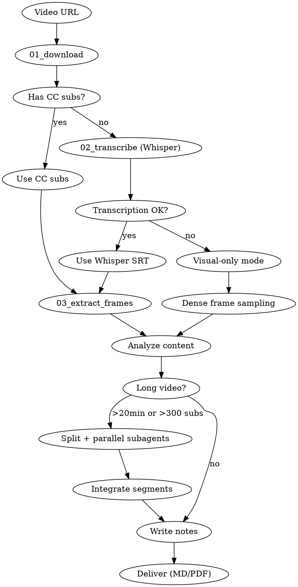

# Video Tutor

Turn a video lecture, tutorial, or technical talk into a structured, figure-rich Chinese teaching note with Markdown or LaTeX/PDF output.

## When to Use

- User provides a video URL and wants structured course notes
- User asks to analyze, summarize, or generate notes from a video
- User provides a Bilibili `BV` number, `b23.tv` short link, or YouTube URL

### When NOT to Use

- User only wants a brief summary without structure
- User wants to download a video without analysis
- User asks about video metadata only

## Platform Differences

| Aspect | Handling |
|--------|----------|
| **Subtitle scarcity** | Try CC subtitles first → fall back to Whisper speech-to-text → visual-only mode |
| **Login-gated HD** | 1080P+ on Bilibili requires cookies; prompt user to use `yt-dlp --cookies-from-browser chrome` |
| **Multi-part videos** | Detect 分P videos and ask user which parts to process before downloading |
| **URL formats** | Support `bilibili.com/video/BVxxxxxxx`, `b23.tv` short links, and YouTube URLs |
| **Danmaku** | Do not use danmaku as teaching content source (too noisy); use only CC subtitles or Whisper output |

## Workflow



## Source Acquisition

### Metadata Inspection

1. Inspect video metadata first: title, chapters, duration, thumbnail, subtitle availability.
2. Detect multi-part (分P) videos — list all parts and ask user which to process.
3. Check cover image availability for front-page use.

### Subtitle Acquisition (Three-Level Fallback)

**Priority 1: CC subtitles (platform-embedded)**

Prefer manual subtitles over auto-generated. Prefer `zh-Hans`, `zh-CN`, `zh`, or `ai-zh` tracks. Preserve timestamps.

```bash
bash scripts/01_download.sh "<URL>" "<TASK_ID>"
```

**Priority 2: Whisper speech-to-text (no CC subtitles available)**

Extract audio, then transcribe with Whisper to produce timestamped SRT.

```bash
bash scripts/02_transcribe.sh <AUDIO_PATH> [WORK_DIR]
```

**Priority 3: Visual-only mode (audio quality too poor)**

Skip subtitles entirely. Rely on dense frame sampling to extract teaching content from video frames alone.

### Video and Cover Download

1. Acquire the video's original cover image before writing notes. Save locally for front-page use.
2. Prefer the best usable video source for figure extraction. Probe formats and choose highest downloadable resolution.
3. Note: 1080P+ on Bilibili typically requires login cookies (`yt-dlp --cookies-from-browser chrome`).
4. Keep all source artifacts local: metadata, cover image, subtitle file (CC or Whisper), optional transcript, local video, extracted frames.

## Long Video Strategy

Do not rely on a single monolithic pass for longer videos.

- If video > 20 minutes or subtitles > 300 entries, split work into smaller segments.
- Prefer chapter boundaries or 分P boundaries for splitting. Fall back to coherent time windows or subtitle ranges.
- When subagents are available, spawn multiple in parallel for different segments.
- Give each subagent a concrete segment boundary. Require it to return: teaching goal, core claims, important formulas/code, required figures with time provenance, and ambiguities needing integration-time resolution.
- Keep small overlap between neighboring segments when explanation crosses boundaries, then deduplicate during integration.
- The main agent must integrate segment outputs into one unified outline and coherent final narrative. Final output must read like a single lecture note, not a concatenation of chunk summaries.

## Teaching Content Rules

Build notes from all available sources:

- video title and chapter structure
- video cover image and key metadata
- on-screen diagrams, formulas, tables, plots, architecture slides
- subtitle explanations, examples, and verbal emphasis
- code snippets shown or described in the talk

**Skip content that does not contribute to the lesson:**

- greetings, small talk, sponsorship
- channel logistics (一键三连, 关注投币, etc.)
- closing pleasantries without teaching value

**Keep the speaker's closing discussion** when it carries actual teaching value: synthesis, limitations, future work, tradeoffs, advice, or open questions.

## Pedagogical Standard

Notes must read like a strong human teacher guiding the reader through the material.

- Organize each major section: **motivation → main idea → mechanism → example/evidence → takeaway**
- Be patient and explicit about logical transitions: why a concept is introduced, what problem it solves, how the next idea follows
- Aim for deep-but-accessible explanations: keep technical depth, introduce formalism only after giving intuition in plain language
- When a section is dense, break into smaller subsections that progressively build understanding rather than compressing into one long derivation
- Do not dump subtitle content in chronological order; rewrite into a teaching sequence with clear intent, contrast, and buildup

### Per-Section Structure

| Step | Content | Purpose |
|------|---------|---------|
| 1 | 动机 | Why introduce this concept? What problem? |
| 2 | 核心思想 | Main point and why it matters |
| 3 | 机制 | How it works in detail |
| 4 | 对比 | Differences from related concepts (use tables) |
| 5 | 例子 | Concrete examples and evidence |
| 6 | 总结 | What should the reader retain |

## Writing Rules

1. Write in Chinese unless the user explicitly requests another language.
2. Organize with `##` and `###` headings. Reconstruct the teaching flow; do not blindly mirror subtitle order.
3. Use figures whenever they materially improve explanation. Do not optimize for small figure count; optimize for explanatory coverage and readability. Good figures are: key formulas, diagrams, tables, plots, visual comparisons, architecture views, stage-by-stage progressions.
4. Do not place images inside custom message boxes.
5. When a mathematical formula appears:
   - Explain in plain Chinese what it expresses and why
   - Show in display math (`$$...$$` for LaTeX, or formatted block in Markdown)
   - Follow with a flat list explaining every symbol
6. When code examples appear:
   - Explain the role before the listing, summarize expected behavior after
   - Wrap in fenced code blocks with language tag (Markdown) or `lstlisting` (LaTeX)
   - Include a descriptive caption
7. Highlight teaching signals deliberately:
   - Use `importantbox` (LaTeX) or `> [!IMPORTANT]` (Markdown) for: core concepts, formal definitions, central claims, key mechanism summaries, critical algorithm steps
   - Use `knowledgebox` (LaTeX) or `> [!NOTE]` (Markdown) for: background, prerequisites, historical context, design tradeoffs, analogies
   - Use `warningbox` (LaTeX) or `> [!CAUTION]` (Markdown) for: common misunderstandings, hidden assumptions, easy mistakes, wrong intuitions vs correct ones
   - No quota of one box per section; add multiple when material contains multiple distinct signals
   - Each box should carry a specific pedagogical payload, not generic emphasis
   - Prefer placing a box immediately after the paragraph that motivates it
   - Figures must stay outside these boxes
8. End every major section with `### 本章小结`. Add `### 拓展阅读` when worthwhile external links exist.
9. End the document with `## 总结与延伸`. That final section must include:
   - The speaker's substantive closing discussion (excluding routine sign-off)
   - Your structured distillation of core claims, mechanisms, and practical implications
   - Cross-links between sections and careful generalization faithful to the video
   - Concrete takeaways, open questions, or next steps
10. Do not emit `[cite]`-style placeholders anywhere.

## Figure Handling

Select figures by necessity and teaching value, not by arbitrary quota or visual sparseness bias.

### Frame Selection Process

1. Use the timestamped subtitle file (SRT, CC or Whisper-generated) as the **primary locator** for key-frame search.
2. First identify the subtitle span corresponding to the concept, formula, or visual explanation being discussed.
3. Search within that subtitle-aligned time interval, and slightly around its boundaries, to find the best readable frame.
4. **Do not jump from one guessed timestamp to one extracted frame.** First generate a dense candidate set across the relevant interval, then inspect and down-select.
5. Use tools that help inspect many nearby candidates at once: `magick montage`, contact sheets, tiled frame strips.
6. For progressive PPT reveals, animations, whiteboard accumulation, or dashboard state changes: explicitly search for the **final fully populated readable state**. Do not stop at the first frame that seems approximately correct.
7. If several nearby candidates differ only by progressive reveal state, keep checking until you find the most complete and readable one.
8. When in doubt between a sparse early frame and a denser later frame, prefer the later frame if materially more complete and still readable.

### Frame Selection Checklist

Before inserting any video frame, inspect several nearby candidates and verify:

| # | Criterion | Requirement |
|---|-----------|-------------|
| 1 | Relevance | Frame must directly support the exact concept in the surrounding text, not just the broad topic |
| 2 | Content visible | Every visual element referenced in text must be visible in the frame |
| 3 | Fully revealed | Use final fully populated readable state, not intermediate or transitional states |
| 4 | Best candidate | Compare multiple nearby frames, select most complete and readable |
| 5 | Readability | Text, formulas, labels, diagrams must be legible enough to justify inclusion |

If any item fails, reject the frame and keep searching nearby.

### Frame Naming

- Use neutral timestamp-based names for raw candidates: `frame_{nn}_{hh}h{mm}m{ss}s.jpg`
- Rename semantically only after visually confirming actual frame content
- Semantic filename must describe the frame's actual visible content, not a guess from subtitles or narration
- If frame is partially revealed, transitional, or ambiguous, keep the timestamp name and keep searching

### Frame Inspection

- Use `view image` tool to inspect candidate frames and crops before deciding what they show
- Do not use OCR tools (`tesseract`) as a substitute for visual understanding
- Do not infer frame semantic content only from nearby subtitles, filenames, or timestamps without checking the image
- Contact sheets and montages are good for recall, but final keep-or-reject decisions must be based on actual image inspection

### Time Provenance

Every figure from a video frame must record its source time interval on the same page:

```markdown

*视频画面时间区间：00:03:05--00:03:15*
```

- The interval must come from the subtitle-aligned segment, not a vague chapter-level estimate
- If the figure is a crop, the footnote still refers to the original video time interval
- Keep figure and its time footnote anchored to the same page (use `[H]` placement in LaTeX)

### Figure Density Guidance

- Include every figure necessary for teaching clarity, even if many figures across the document
- It is acceptable and often desirable to include several figures within one section when the video builds an idea in stages
- Omit repetitive or low-information frames
- Prefer a sequence of necessary figures over one overloaded figure with unreadable labels
- For dense visual sections, over-sample first and discard later — do not optimize candidate count so early that key visual states are never inspected

## Visualization

For concepts hard to explain with screenshots and prose alone, add accurate visualizations.

**Two acceptable routes:**
- Generate LaTeX-native visualizations with TikZ or PGFPlots
- Generate figures with Python (`matplotlib`, `seaborn`) and include as images

**For script-generated illustrations:**
- Export as PDF for vector quality (no rasterization loss)
- Prefer vector output for plots, charts, schematic illustrations
- Avoid PNG/JPG for script-generated figures unless inherently raster

**When source material contains relationships, results, or equations clearer when redrawn than when shown as a screenshot**, prefer rebuilding with LaTeX-native tools or matplotlib/seaborn.

**Use visualizations for:** process flows, pipelines, architecture overviews, curves and charts (scaling laws, training curves, benchmarks), distributions, correlations, heatmaps, complex functions, surfaces, summary diagrams compressing a section's core takeaway.

Do not add decorative graphics.

## Scripts Quick Reference

| Script | Purpose | Usage |
|--------|---------|-------|
| `scripts/00_setup.sh` | Initialize work directory | `bash 00_setup.sh [TASK_ID]` |
| `scripts/01_download.sh` | Download video + audio + subtitles (CC fallback) | `bash 01_download.sh <URL> [TASK_ID]` |
| `scripts/02_transcribe.sh` | Whisper speech-to-text → TXT + SRT | `bash 02_transcribe.sh <AUDIO> [WORK_DIR]` |
| `scripts/03_extract_frames.sh` | Extract frames by timestamp JSON array | `bash 03_extract_frames.sh <VIDEO> '[\"00:02:30\",\"00:05:10\"]' [OUT_DIR]` |

Config: `config.env` — Python venv path, Whisper model (`small`), CUDA paths, FFmpeg, cache settings.

## Output Files

```
{task_id}/
├── video.mp4              # Downloaded video
├── audio.wav              # Extracted audio
├── transcript.txt         # Timestamped transcript
├── transcript.srt         # SRT subtitle file
├── info.txt               # Task metadata
├── cover.jpg              # Video cover image
├── images/
│   └── frame_{nn}_{hh}h{mm}m{ss}s.jpg
└── {task_id}_REPORT.md    # Final report
```

Data directory: `~/.openclaw/openclaw-data/video-tutor/`

## LaTeX Output (Optional)

For PDF output, copy and fill `assets/notes-template.tex`:
- Fill metadata block: `\notetitle`, `\noteauthors`, `\notedate`, `\videochannel`, `\videopublishdate`, `\videoduration`, `\videourl`, `\videocoverpath`
- Place cover image on front page via `\videocoverpath`
- Use `importantbox`, `knowledgebox`, `warningbox` for teaching signals (defined in template)
- Keep figures outside these boxes
- Include time provenance footnotes for all video-sourced figures (use `\footnotemark`/`\footnotetext` with `[H]` placement)
- End with `\section{总结与延伸}`
- Compile to PDF as part of delivery

## Final Checklist

Before delivery, verify:

- [ ] No important teaching content dropped during condensation or restructuring
- [ ] Text and figures aligned: each frame supports surrounding explanation, shows fullest relevant information
- [ ] Document visually rich enough: check if more key frames or visualizations would improve clarity
- [ ] All figures have time provenance footnotes
- [ ] No `[cite]` placeholders
- [ ] LaTeX compiles successfully (if PDF output requested)
- [ ] Cover image on front page (when available)

## Delivery

Deliver all of:
- Final report (Markdown or compiled LaTeX/PDF)
- Downloaded cover image
- Extracted or generated figure assets
- Whisper-generated SRT file (if speech-to-text was used)
- Compiled PDF (if LaTeX output requested)
